# Self-Driving Car Engineer Nanodegree Project: Vehicle Detection Project
by Xueyi Zou email:xy.zou@outlook.com

## Overview

The goals / steps of this project are the following:

* Perform a Histogram of Oriented Gradients (HOG) feature extraction on a labeled training set of images and train a Linear SVM classifier
* Optionally, you can also apply a color transform and append binned color features, as well as histograms of color, to your HOG feature vector.
* Note: for those first two steps don't forget to normalize your features and randomize a selection for training and testing.
* Implement a sliding-window technique and use your trained classifier to search for vehicles in images.
* Run your pipeline on a video stream and create a heat map of recurring detections frame by frame to reject outliers and follow detected vehicles.
* Estimate a bounding box for vehicles detected.


## Dependencies

This project requires **Python 3.5** and the following Python libraries installed:
- [NumPy](http://www.numpy.org/)
- [SciPy](http://www.scipy.org/)
- [Matplotlib](http://matplotlib.org/)
- [OpenCV](http://opencv.org/)
- [Scikit-image](http://scikit-image.org/)
- [Scikit-learn](http://scikit-learn.org/stable/index.html)
- [Moviepy](http://zulko.github.io/moviepy/)


## Folders and Files
- `data`: Folder to hold labeled training data. The data include labeled data for [vehicles](https://s3.amazonaws.com/udacity-sdc/Vehicle_Tracking/vehicles.zip) and [non-vehicles](https://s3.amazonaws.com/udacity-sdc/Vehicle_Tracking/non-vehicles.zip).

- `test_images`: Folder to hold test images.

- `output_images`: Folder to hold examples of the output from each stage of the image processing pipeline. It also contains the video output.

- `helper_functions.py`: some useful functions adapted from course materials.

- `prepare_data.py`: python script to load training data. After loading them, the data are saved in `data_pickle.p`.

- `train_classifier.py`: python scripts to train an SVM (Support Vector Machine) model for classifying cars and non-cars. When done, the trained model and some other important information (such as HOG feature  parameters and `X_scaler`) are saved in `classifier_pickle.p`. It also includes scripts to tune the HOG feature parameters, which will generate `parameter_tuning_pickle.p`.

- `search_classify_image.py`: python script to detect vehicles in images.

- `search_classify_video.py`: python script to detect vehicles in videos.

- `project_video.mp4`: the video used to test the vehicle detection pipeline.

- `test_video.mp4`: a very short video used to test the vehicle detection pipeline.

- `README.md`: the requirements of this project.

- `writeup.md`: (this file) explains the vehicle detection pipeline.

- `LICENSE`: GNU GENERAL PUBLIC LICENSE file.

## How to use

1. run python script in `prepare_data.py` to prepare training data.

1. run python scripts (skip code cell 2 if you don't want to tune HOG parameters) in `train_classifier.py` to train a SVM classifier.

1. run python scripts in `search_classify_image.py` to detect vehicles in images.

1. run python scripts in `search_classify_video.py` to detect vehicles in videos.

---
## [Rubric](https://review.udacity.com/#!/rubrics/513/view) Points
Here I will consider the rubric points individually and describe how I addressed each point in my implementation.  

### Writeup / README

#### 1. Provide a Writeup / README that includes all the rubric points and how you addressed each one.  You can submit your writeup as markdown or pdf.  [Here](https://github.com/udacity/CarND-Vehicle-Detection/blob/master/writeup_template.md) is a template writeup for this project you can use as a guide and a starting point.  

You're reading it!

### Histogram of Oriented Gradients (HOG)

#### 1. Explain how (and identify where in your code) you extracted HOG features from the training images.

The code for extracting HOG features is defined in the `get_hog_features(img, orient, pix_per_cell, cell_per_block, vis=False, feature_vec=True)` function located in `helper_functions.py`.

I started by reading in all the `vehicle` and `non-vehicle` images.  Here are some examples of the `vehicle` and `non-vehicle` classes:

vehicle | non-vehicle        
----|-------
 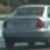 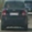  |  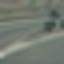 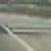
    |   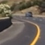

I then explored different color spaces and channels, and different `skimage.hog()` parameters (`orient`, `pixels_per_cell`). However, I fixed the `cells_per_block` to be (2, 2), since I don't see much space for tuning it for images sized at 64*64.

I grabbed random images from each of the two classes and displayed them to get a feel for what the `skimage.hog()` output looks like. Here is an example using the `YCrCb` color space with HOG parameters of `orientations=6`, `pixels_per_cell=(8, 8)` and `cells_per_block=(2, 2)`:

<p align="center">
 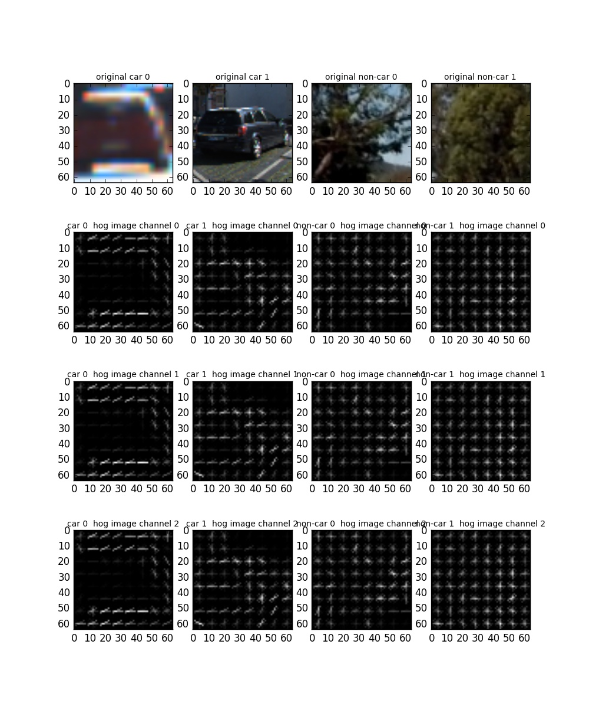
</p>


#### 2. Explain how you settled on your final choice of HOG parameters.

The idea to set HOG parameters is that I traversed different combinations of the parameters (i.e. `color_space`, `hog_channel`, `orient`, `pix_per_cell`) and find the one that generates a very high (if not the highest) test accuracy of the trained classifier. Note that I didn't tune `cells_per_block` but set it to be (2, 2), since I didn't see much space for tuning it for images sized at 64*64.

The code for setting HOG parameters is in code cell 2 of `train_classifier.py` as following:

```
#%% code cell 2: Tune parameters
parameters=[]
test_accurs=[]

color_spaces = ['RGB', 'HSV', 'LUV', 'HLS', 'YUV', 'YCrCb']
hog_channels = [0,1,2,'ALL'] # Can be 0, 1, 2, or "ALL"
orients = [6,7,8,9,10,11,12]  # HOG orientations
pix_per_cell_values = [8,16] # HOG pixels per cell

cell_per_block = 2 # HOG cells per block
spatial_size = (16, 16) # Spatial binning dimensions
hist_bins = 16    # Number of histogram bins
spatial_feat = True # Spatial features on or off
hist_feat = True # Histogram features on or off
hog_feat = True # HOG features on or off

t=time.time()
for color_space in color_spaces:
    for hog_channel in hog_channels:
        for orient in orients:
            for pix_per_cell in pix_per_cell_values:
                parameters.append((color_space,hog_channel, orient, pix_per_cell))
                _, _, test_accur=train(color_space,hog_channel, orient,pix_per_cell,cell_per_block = cell_per_block,
                                  spatial_size = spatial_size, hist_bins = hist_bins,
                                  spatial_feat = spatial_feat, hist_feat = hist_feat, hog_feat = hog_feat)
                test_accurs.append(test_accur)
                print('-------------------'*5)

t2=time.time()
print(round(t2-t, 2), 'Seconds to tune parameters...')
```

This process took about 4 hours and I finally set the parameters as follows:

```
color_space ='YCrCb'
hog_channel = 'ALL'
orient = 6
pix_per_cell= 8
cell_per_block = 2
spatial_size = (16, 16)
hist_bins = 16
spatial_feat = True
hist_feat = True
hog_feat = True
```
With this setting, the trained SVM classifier generates a test accuracy of 0.995 on test data (20% of the whole data).


#### 3. Describe how (and identify where in your code) you trained a classifier using your selected HOG features (and color features if you used them).

In code cell 1 of the `train_classifier.py` file, I defined a function named `train(color_space,hog_channel, orient,pix_per_cell,cell_per_block = 2,spatial_size = (16, 16), hist_bins = 16,spatial_feat = True, hist_feat = True, hog_feat = True)`. This function defined the process to train an SVM classifier. In code cell 3 of the same file, I call this function with the HOG parameters found in the previous step to do training.

In addition to HOG features, I also used color features. The function to extract features is `extract_features(imgs, color_space='RGB', spatial_size=(32, 32), hist_bins=32, orient=9, pix_per_cell=8, cell_per_block=2, hog_channel=0,spatial_feat=True, hist_feat=True, hog_feat=True)`, which calls `get_hog_features()`, `bin_spatial()`, and `color_hist()`. These functions are all defined in `helper_functions.py` file.


### Sliding Window Search

#### 1. Describe how (and identify where in your code) you implemented a sliding window search.  How did you decide what scales to search and how much to overlap windows?

I used a function names `generate_windows(img_shape, overlap=0.6)` to generate sliding windows. This function in turn calls `slide_window(img_shape, x_start_stop=[None, None], y_start_stop=[None, None],xy_window=(64, 64), xy_overlap=(0.5, 0.5))` to generate  fixed sized (defined by parameter `xy_window`) sliding windows in certain area (defined by parameters `x_start_stop` and `y_start_stop`) with certain overlap rate (defined by `xy_overlap`).

I generate small windows near the horizon, and generate larger windows near the camera (i.e. the bottom of the picture). I tried different window sizes and overlap rates, and the following setting to generate sliding windows seemed to be able to get good results:

size | y_start_stop        
----|-------
(64, 64) |[400, 500]
(96, 96) | [400, 500]
(128, 128) | [450, 600]
(160, 160) | [500, 670]

The final overlap rate chosen is 0.75.

And following shows the generated windows on a test image (i.e. `./test_images/test1.jpg` )

<p align="center">
 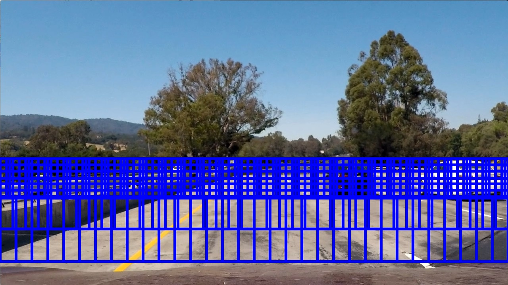
</p>

#### 2. Show some examples of test images to demonstrate how your pipeline is working. How did you optimize the performance of your classifier?

The search of vehicles in the generated sliding windows was done by calling a function named `search_windows()` in `helper_functions.py`.

The following code (in `search_classify_image.py`) shows the steps of the vehicle detection pipeline for images:

```
windows_all=generate_windows(img_shape, overlap=0.75)
hot_windows = search_windows(image,windows_all, svc, X_scaler, color_space=color_space,
                        spatial_size=spatial_size, hist_bins=hist_bins,
                        orient=orient, pix_per_cell=pix_per_cell,
                        cell_per_block=cell_per_block,
                        hog_channel=hog_channel, spatial_feat=spatial_feat,
                        hist_feat=hist_feat, hog_feat=hog_feat)

heatmap = np.zeros_like(image[:,:,0]).astype(np.float)
heatmap =add_heat(heatmap, hot_windows)
heatmap_thresholded = apply_threshold(heatmap,2)
labels = label(heatmap_thresholded)
# Draw bounding boxes on a copy of the image
cars_found_img = draw_labeled_bboxes(np.copy(image), labels)
```
Note that here I used thresholded heatmaps to avoid false positives.

Following shows the results of the pipeline steps (on `./test_images/test1.jpg`):

<p align="center">
 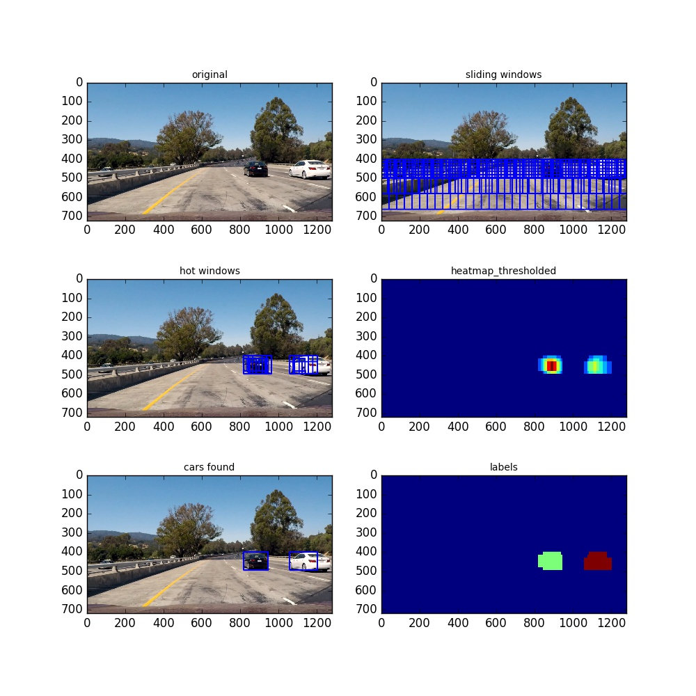
</p>

Following shows more results of the pipeline on test images in `test_images` folder:

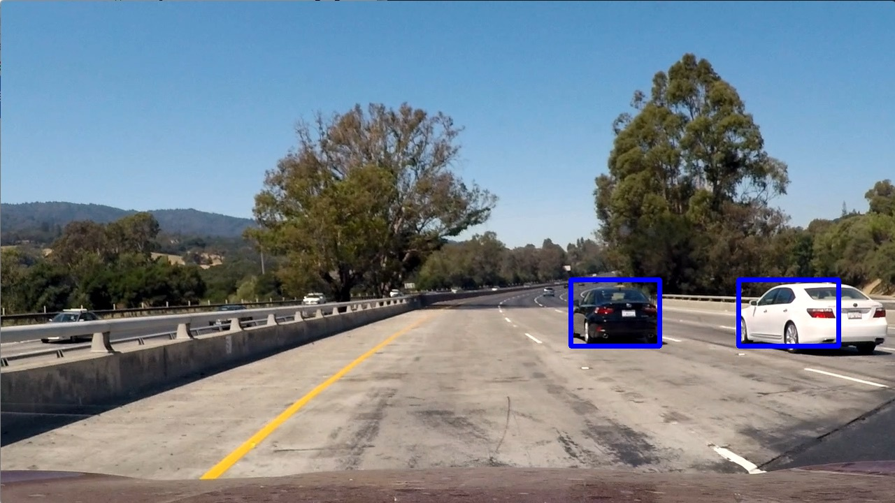 |       
----|-------
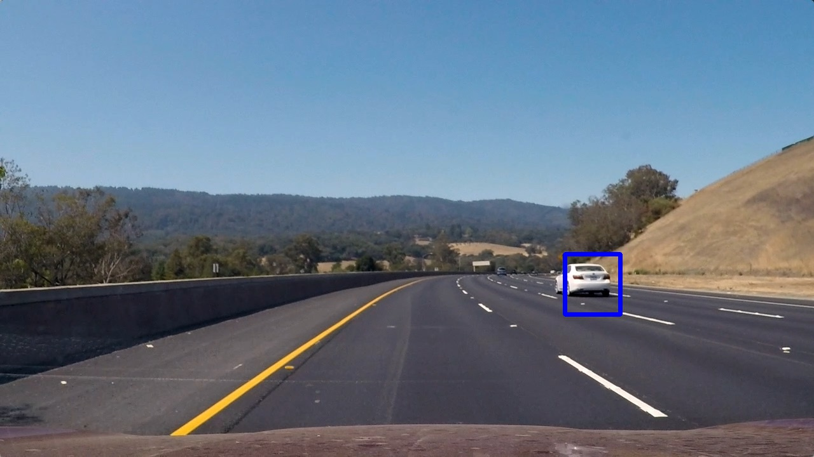 | 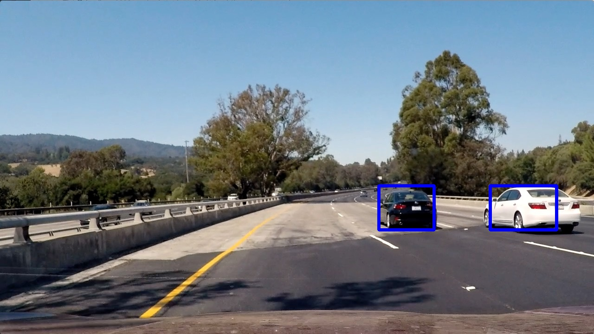  
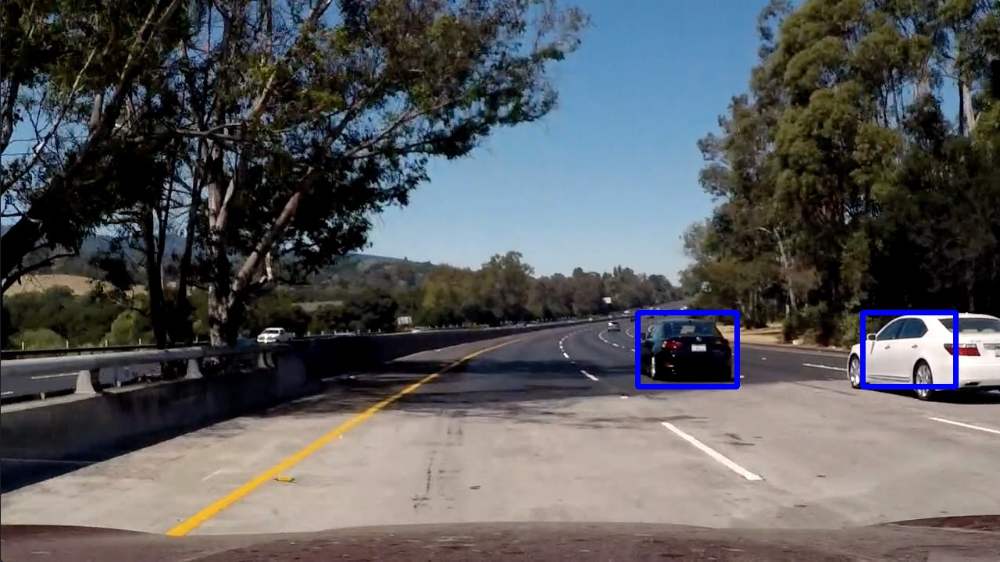 | 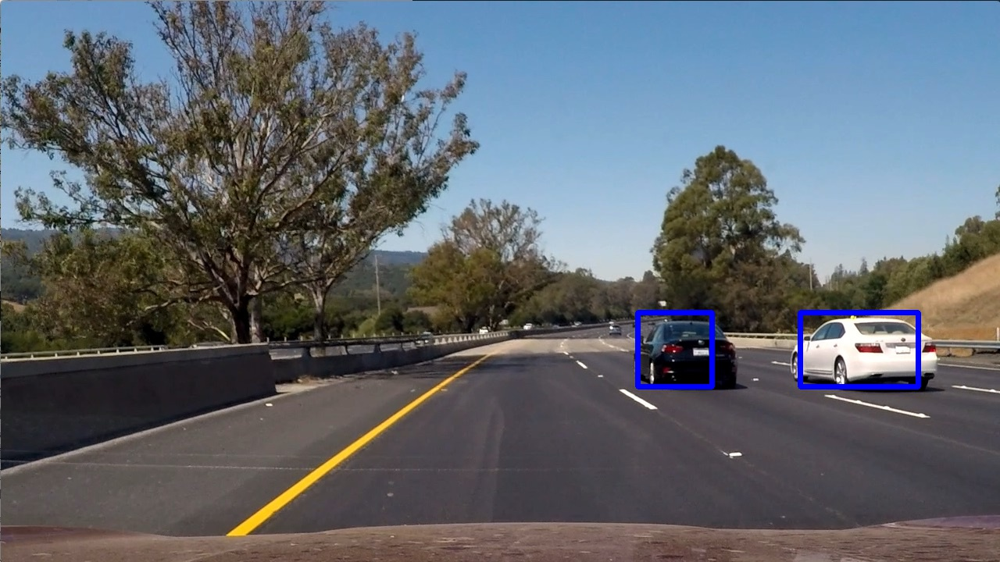    


### Video Implementation

#### 1. Provide a link to your final video output.  Your pipeline should perform reasonably well on the entire project video (somewhat wobbly or unstable bounding boxes are ok as long as you are identifying the vehicles most of the time with minimal false positives.)
Here's a [link to my video result](./output_images/project_video_output.mp4)


#### 2. Describe how (and identify where in your code) you implemented some kind of filter for false positives and some method for combining overlapping bounding boxes.
The code for processing videos is located in `search_classify_video.py`. The pipeline for video is as follows:
```
def car_detection_pipeline():
    windows=[]
    pre_heatmaps=[]
    def process(image):
        # NOTE: The output you return should be a color image (3 channel) for processing video below
        nonlocal windows
        if not windows:
            windows=generate_windows(image.shape, overlap=0.75)

        hot_windows = search_windows(image,windows, svc, X_scaler, color_space=color_space,
                                spatial_size=spatial_size, hist_bins=hist_bins,
                                orient=orient, pix_per_cell=pix_per_cell,
                                cell_per_block=cell_per_block,
                                hog_channel=hog_channel, spatial_feat=spatial_feat,
                                hist_feat=hist_feat, hog_feat=hog_feat)

        cur_heatmap = np.zeros_like(image[:,:,0]).astype(np.float)
        cur_heatmap =add_heat(cur_heatmap, hot_windows)

        sum_heatmap=np.copy(cur_heatmap)
#        weights=[1,1,1,1,1]
        weights=[0.4,0.5,0.6,0.8,0.9]
        for idx,pre_heatmap in enumerate(pre_heatmaps):
            sum_heatmap += weights[idx]*pre_heatmap

        ave_heatmap= sum_heatmap/(1+sum(weights[0:len(pre_heatmaps)]))
        heatmap_thresholded = apply_threshold(ave_heatmap,1.5 )

        pre_heatmaps.append(cur_heatmap)
        if len(pre_heatmaps)>5:
            del pre_heatmaps[0]
        assert len(pre_heatmaps)<=5

        labels = label(heatmap_thresholded)
        # Draw bounding boxes on a copy of the image
        draw_img = draw_labeled_bboxes(np.copy(image), labels)
        return draw_img

    return process
```

This pipeline is similar to that used for processing images, except that I used a list `pre_heatmaps` to store previous **5** heatmaps. The newly generated heatmap and those previous heatmaps are averaged with weights, and the `ave_heatmap` was thresholded and used for detecting vehicles.

I used `scipy.ndimage.measurements.label` to find separate areas in the `heatmap_thresholded` to locate vehicles. The function `draw_labeled_bboxes()` in `helper_functions.py` was used to determined the extent of each bounding box for each vehicle.


### Discussion

#### 1. Briefly discuss any problems / issues you faced in your implementation of this project.  Where will your pipeline likely fail?  What could you do to make it more robust?

The main difficulty of this project for me is how to track the vehicle from one frame to another. Finally, I used a list to keep previous 5 heatmaps and used a avarage heatmap to locate vehicles in a new frame. The results seemed OK, but there may be better ways.

The pipeline will fail when two vehicles were very close -- the two vehicles were treated as one. The pipeline will also likely fail when vehicles are partially obstructed.

The pipeline is time-consuming and far from real-time. Better ways could be explored, for example, by only generating sliding windows around previous detected vehicle locations.

-------------
## Acknowledge
Some code were adapted from the course materials.
